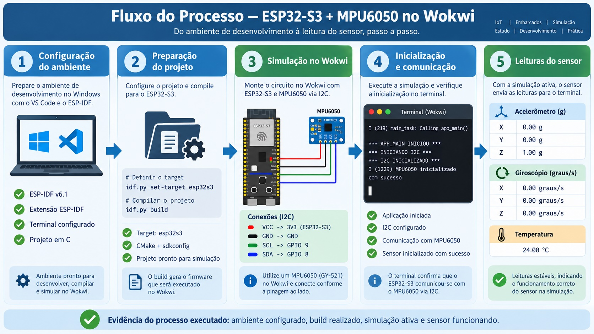
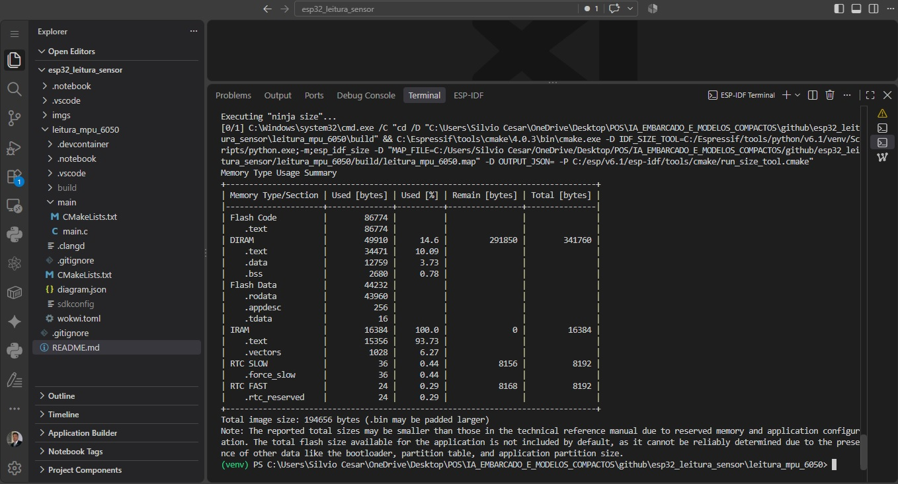
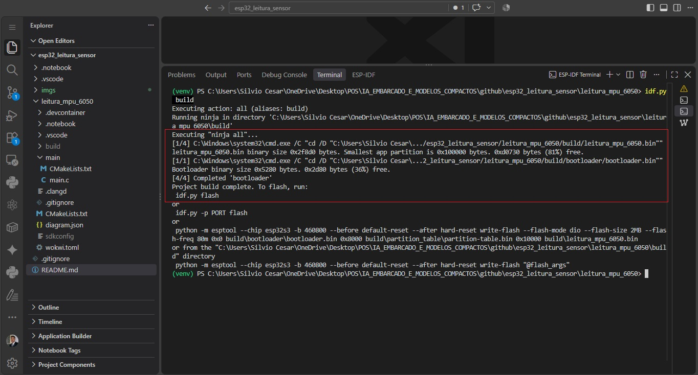
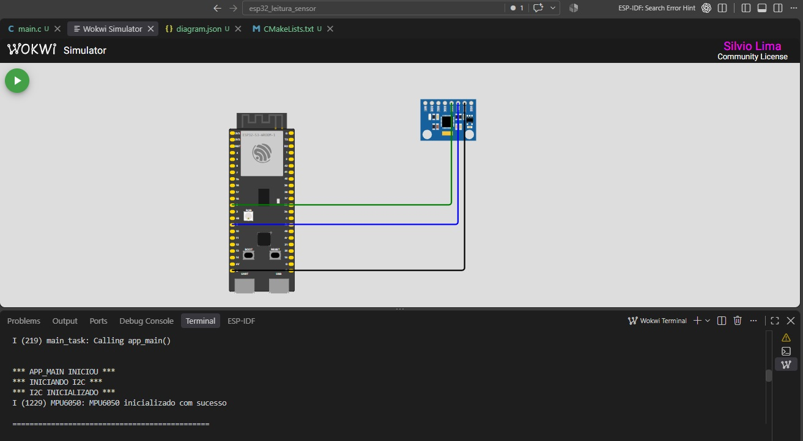
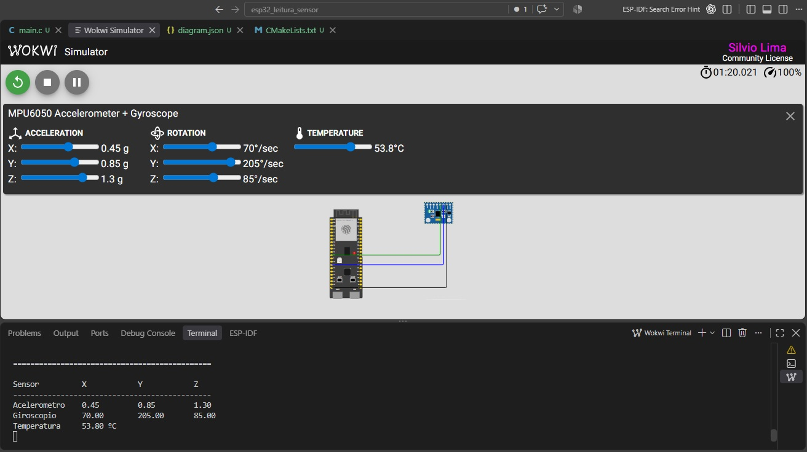

# Leitura de sensor com ESP32 e MPU6050

## Atividade:

## Descrição da atividade desenvolvida

Esta atividade teve como objetivo desenvolver uma aplicação embarcada completa para leitura de dados de um sensor acelerômetro/giroscópio utilizando o ESP32-S3 e o framework ESP-IDF no VS Code. A simulação foi realizada com a extensão Wokwi, permitindo testar o circuito e o firmware de forma prática antes da execução real.

O projeto implementa a leitura do módulo MPU6050 por comunicação I2C, configurando corretamente o barramento, inicializando o sensor e exibindo no monitor serial os valores de:

- aceleração em X, Y e Z;
- giroscópio em X, Y e Z;
- temperatura interna do sensor.

A aplicação foi desenvolvida em linguagem C e validada em ambiente simulado dentro do Wokwi, com o ESP32-S3 conectado ao MPU6050 conforme a documentação do módulo.

## Objetivo

Desenvolver um sistema embarcado capaz de:

1. configurar corretamente o ESP32-S3 para comunicação I2C;
2. inicializar o sensor MPU6050;
3. ler os dados do sensor;
4. processar e converter os valores para unidades físicas;
5. exibir as leituras no monitor serial;
6. registrar evidências da simulação e do funcionamento do sistema.

## Estrutura do repositório

- `leitura_mpu_6050/` — diretório principal do projeto gerado no VS Code com o ESP-IDF, contendo todos os arquivos de configuração, o código-fonte e arquivos de compilação/simulação.
- `imgs/` — imagens de evidência da atividade, incluindo circuitos, simulação e tela do monitor serial.
- `README.md` — documentação do projeto e descrição da atividade.

## Projeto principal

O código principal está localizado em:

- `leitura_mpu_6050/main/main.c`

Ele realiza:

- inicialização do barramento I2C;
- configuração do endereço do MPU6050 (`0x68`);
- despertar o sensor no registrador de gerenciamento de energia;
- leitura dos registradores de aceleração, giroscópio e temperatura;
- conversão dos valores brutos para unidades físicas;
- impressões formatadas no monitor serial.

## Configuração do circuito simulado

A simulação foi montada no Wokwi com o seguinte esquema:

- ESP32-S3 DevKitC-1
- Sensor MPU6050

Conexões realizadas:

- `3V3` → `VCC`
- `GND` → `GND`
- `GPIO8` → `SDA`
- `GPIO9` → `SCL`

O arquivo de diagrama do circuito está em:

- `leitura_mpu_6050/diagram.json`

## Arquivos gerados no VS Code e compilados

No diretório `leitura_mpu_6050` encontram-se os arquivos gerados pelo ambiente de desenvolvimento do VS Code e do ESP-IDF, como:

- `CMakeLists.txt`
- `diagram.json`
- `wokwi.toml`
- estrutura da pasta `main/`
- arquivos de configuração e compilação do projeto

Esses arquivos representam a base do projeto desenvolvido e a execução da simulação com o sensor MPU6050.

## Evidências do trabalho

As imagens presentes em `imgs/` documentam a atividade e servem como evidência do desenvolvimento e da simulação:

### Build do projeto

### Simulador Wokwi: inicialização e funcionamento do sistema

### Simulador Wokwi: Sensor MPU6050

## Resultados esperados

Ao executar a aplicação, o monitor serial deve exibir valores de aceleração, giroscópio e temperatura do sensor MPU6050, confirmando que a leitura do componente foi realizada corretamente e que o sistema embarcado está funcionando conforme o projeto proposto.

## Conclusão

A atividade foi concluída com sucesso no ambiente de simulação do Wokwi, utilizando o ESP32-S3 e o sensor MPU6050 para implementar uma aplicação embarcada em C com leitura de dados em tempo real. O repositório reúne o código fonte, os arquivos do projeto no VS Code e as evidências visuais da execução.
